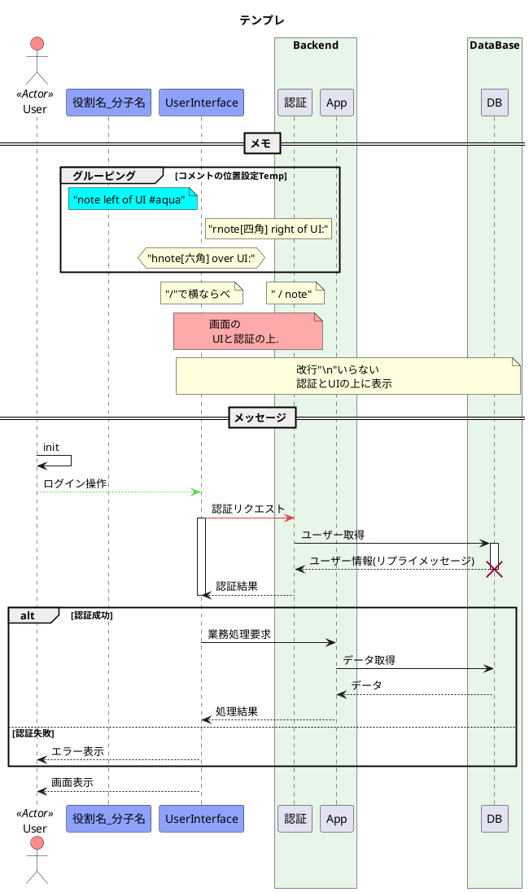
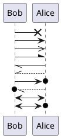
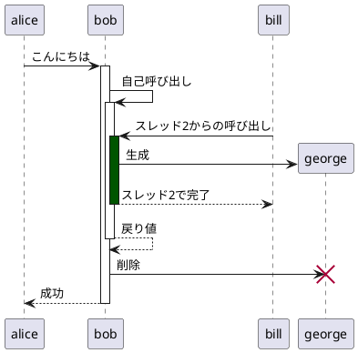
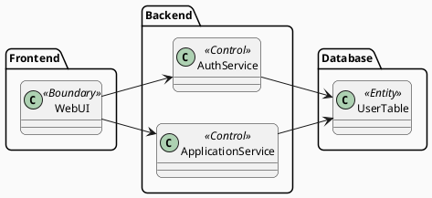

PlantUML を使用することで、以下のような構造化された UML 図を作成することができます：
- [シーケンス図](https://plantuml.com/ja/sequence-diagram)
- [ユースケース図](https://plantuml.com/ja/use-case-diagram)
- [クラス図](https://plantuml.com/ja/class-diagram)
- [オブジェクト図](https://plantuml.com/ja/object-diagram)
- [アクティビティ図](https://plantuml.com/ja/activity-diagram-beta)（[レガシー構文はこちら）](https://plantuml.com/ja/activity-diagram-legacy)
- [コンポーネント図](https://plantuml.com/ja/component-diagram)
- [配置図](https://plantuml.com/ja/deployment-diagram)
- [状態図](https://plantuml.com/ja/state-diagram)
- [タイミング図](https://plantuml.com/ja/timing-diagram)

シーケンス図（処理フロー）

---

---

図③：構造・責務整理図（クラス図）

