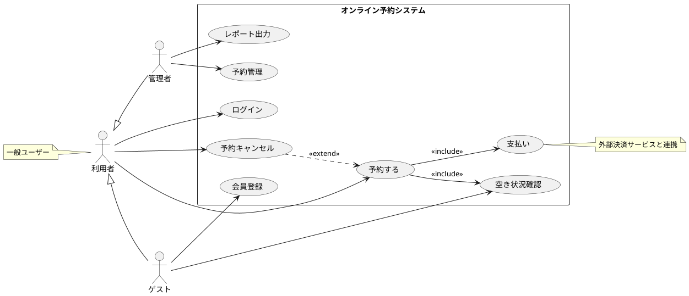

```plantuml
@startuml
' 方向指定
left to right direction

' アクター定義
actor 利用者
actor 管理者
actor ゲスト

' アクターの汎化
利用者 <|-- ゲスト
利用者 <|-- 管理者

' システム境界
rectangle "オンライン予約システム" {

  ' ユースケース
  usecase "ログイン" as UC_Login
  usecase "会員登録" as UC_Register
  usecase "予約する" as UC_Reserve
  usecase "空き状況確認" as UC_Check
  usecase "支払い" as UC_Pay
  usecase "予約キャンセル" as UC_Cancel
  usecase "予約管理" as UC_Manage
  usecase "レポート出力" as UC_Report

  ' include（必須処理）
  UC_Reserve --> UC_Check : <<include>>
  UC_Reserve --> UC_Pay   : <<include>>

  ' extend（条件付き処理）
  UC_Cancel ..> UC_Reserve : <<extend>>

}

' アクターとユースケースの関連
利用者 --> UC_Login
利用者 --> UC_Reserve
利用者 --> UC_Cancel

ゲスト --> UC_Register
ゲスト --> UC_Check

管理者 --> UC_Manage
管理者 --> UC_Report

' ノート
note right of UC_Pay
  外部決済サービスと連携
end note

note left of 利用者
  一般ユーザー
end note

@enduml
```
